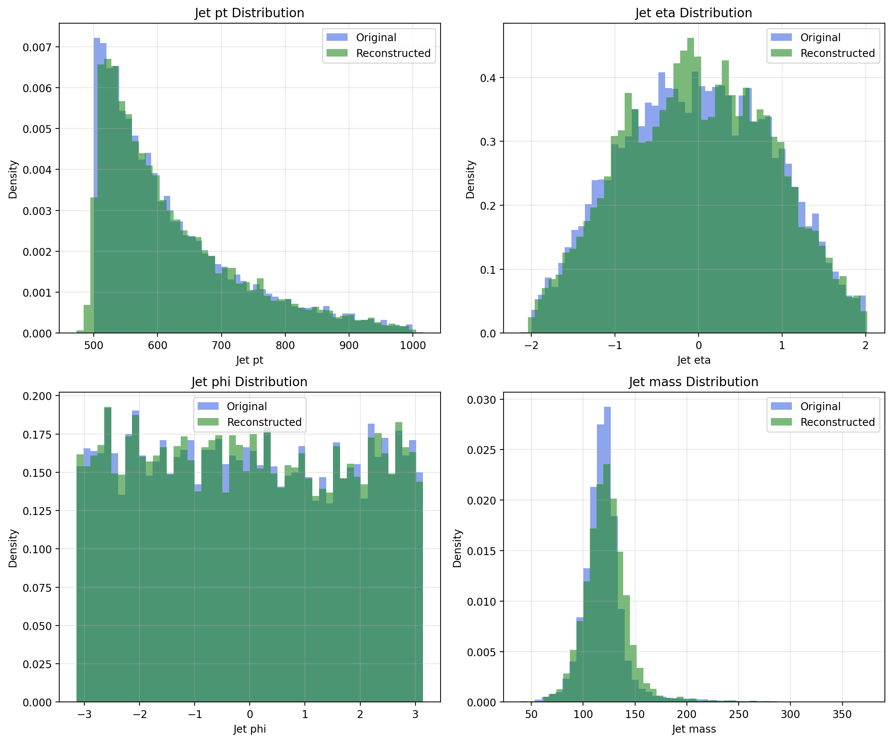
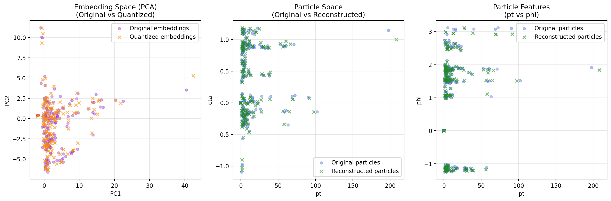
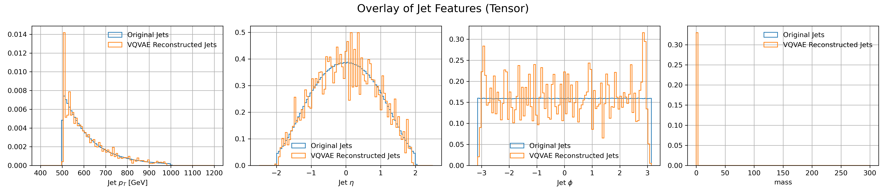
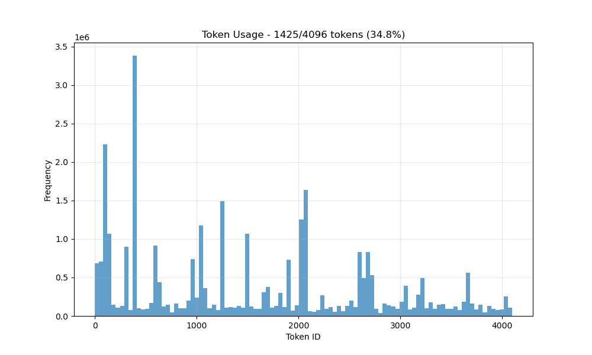
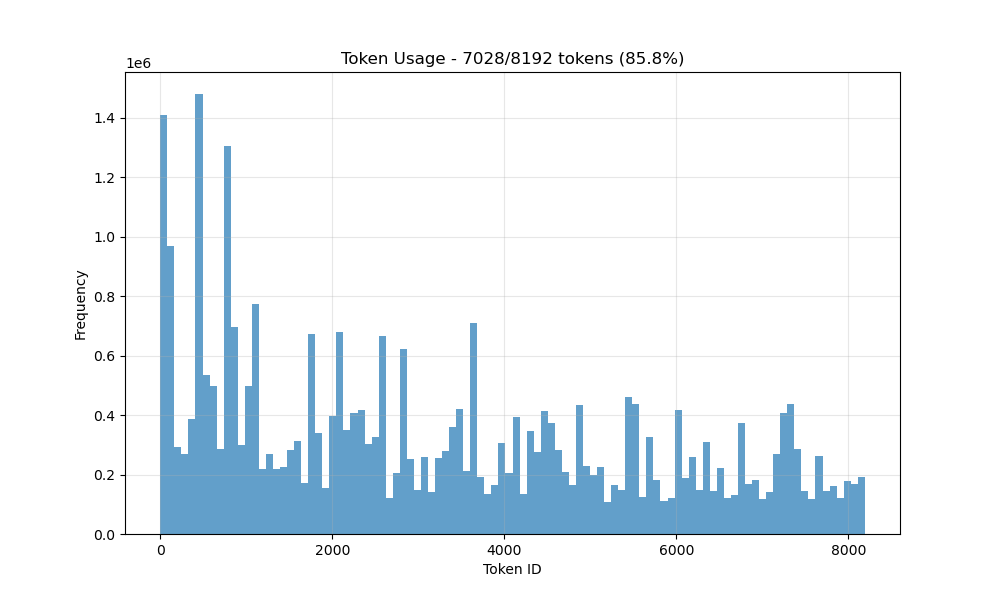
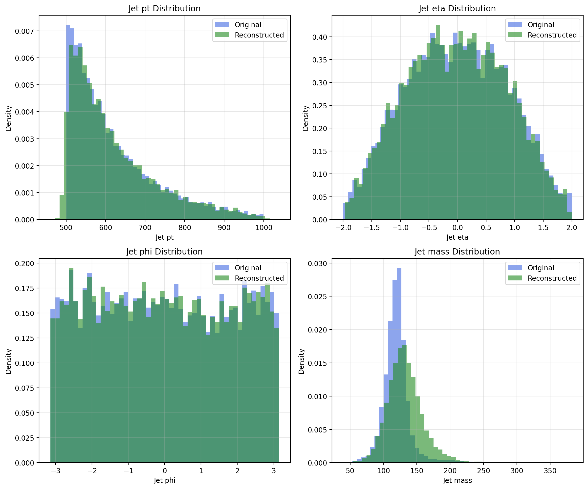

# LLM4Tracking

LLM4Tracking explores foundation models for particle physics. It is an experimental code base focused on building tokenizers and generative models for jets. The project currently focuses on developing MOE-empowered VQ-VAE style models that can encode sets of jet constituents into discrete tokens, and integrating them into a language model.

---

## 1. Overview

The long--term goal is to create a unified foundation model that can understand and generate collider events. A first step toward this goal is learning a **tokenizer** for jet constituents. The repository contains utilities to read the JetClass dataset, several trained conditional tokenizers, several backbone models, and plotting utilities to visualize results. Typical use cases include:

- Training a baseline vector-quantised autoencoder (VQ-VAE), or with different add-ons.
- Integrating it with a backbone language model like NanoGPT.

---

## 2. Quick Start

To get started with LLM4Tracking:

### Install Dependencies
```bash
pip install -r requirements.txt
```

### Explore the Dataset
First, visualize the JetClass dataset to understand what we're working with:
```bash
python plot/plot.py plot_jet_and_particle_features  # Plot all jet classes
```

Check the pre-generated event graphs in the [`plot/event_graphs/`](plot/event_graphs) directory to see examples of different jet types.

### Train Your First Model
Run the full training pipeline on multiple GPUs for 10 checkpoints:
```bash
python scripts/train_all.py  # Multi-GPU training for 10 epochs
```

### Evaluate Model Performance
Compare different checkpoints to assess model performance:
```bash
python scripts/eval/compare_checkpoints.py --checkpoints 3,5,10
```

---

## 3. Dataset

All data loading utilities live in the [`dataloader/`](dataloader) folder and are built around the **JetClass** dataset. A ROOT file is read via `read_file()` which converts jet and particle features into padded NumPy arrays. Example features include jet `pt`, `eta`, `phi` and per--particle `pt`, `eta`, `phi`.

Two dataloader variants are provided:

- [`dataloader/dataloader.py`](dataloader/dataloader.py): returns tensors of shape `[B, F, N]` for particles and `[B, J]` for jets. Useful when no padding mask is required.
- [`dataloader/masked_dataloader.py`](dataloader/masked_dataloader.py): additionally yields a mask tensor `[B, N]` indicating valid particles.

Both expose helpers such as `load_jetclass_label_as_tensor()` and `load_jetclass_label_as_dataset()` so you can load either a specific label or multiple classes. There is also [`dataloader/load.py`](dataloader/load.py) which demonstrates reading file lists from `config.yaml` to assemble full training/validation splits.

---

## 4. Models

Several VQ-VAE style models are implemented under [`models/`](models):

1. **VQVAE MLP (particles)** – [`vqvaeMLP_particle.py`](models/vqvaeMLP_particle.py)
   - A simple multilayer perceptron baseline operating on per--particle features.
2. **VQVAE MLP (jets)** – [`vqvaeMLP_jet.py`](models/vqvaeMLP_jet.py)
   - Encodes global jet features and serves as a lightweight baseline.
3. **VQVAE NormFormer** – [`NormFormer.py`](models/NormFormer.py)
   - Implements the "OmniJet" idea using a stack of NormFormer blocks to process sequences of particles.
4. **VQVAE Flash** – [`NormFormer_Flash.py`](models/NormFormer_Flash.py)
   - A deeper architecture that utilises FlashAttention for faster training and supports larger codebooks, uses masking.
5. **VQVAE MOE** – [`NormFormer_Flash.py`](models/NormFormer_Flash.py)
   - Uses 4 experts and top_k = 2, employinng mixture of experts for more effecient training.

Each model produces a reconstruction along with VQ statistics. The NormFormer variants accept optional particle masks for variable–length jets. With more details covered in models.md.

### Model Architecture

A basic visualization of model architecture looks like:


---

## 5. Plots and Visualisation

The [`plot/`](plot) directory hosts scripts for analysing models and datasets:

- [`plot/plot.py`](plot/plot.py) can generate histograms of jet and particle features for any subset of JetClass events. It also contains utilities to compare reconstructed jets to the originals.
- Pre–generated summaries for different JetClass labels can be found in [`plot/event_graphs/`](plot/event_graphs).
- Training curves and reconstruction overlays are stored under [`plot/training_plots/`](plot/training_plots).

Usage examples:

```bash
python plot/plot.py plot_jet_and_particle_features  # plots all jet classes
python plot/plot.py plot_all                         # Plot overlaid of different classes
python plot/plot.py plot_difference                  # Plot differences between two distributions
python plot/plot.py plot_tensor_jet_features         # Plot based on a given pytorch tensor
python plot/plot.py reconstruct_jet_from_particle    # given jet, output the reconstructed particles
```

---

## 6. Training

The major training objective is the reconstruction of pt, eta, and phi distribution of particles, with the goal of learning the mass distribution and jet level information correctly. This is visualized by reconstructing jets from the original particles, and then plotting the jet distributions to compare with the original.

For a quick start in training: `scripts/train_all.py` is a self-contained training script that includes all available hyperparameters/model choice at the top. The suggested starting point is the MOE model, which is the fastest to train.

To get a more detailed view of different training structures, there are also more focused training scripts:

```bash
python scripts/new_train_masked.py    # train with masking of particles
python scripts/train_normformer.py    # Train the baseline normformer particle encoder
python scripts/train_jet.py           # Train the jet encoders
python scripts/moe.py                 # experiment with hyperparameters for the mixture of expert models
```

The `scripts/eval/` directory contains series of checkpoint comparison, plot, and dimensionality reduction plot utilities.

---

## 7. Results 

The primary results of this repository consist of two parts: accuracy of particle reconstruction and understanding of adjustments of different model hyperparameters. 

### Performance Results

In terms of performance, the current best performance is exhibited by the MOE_med model. With 6 hours of training on 4 GPUs, it can reconstruct on all 10 class labels with high accuracy as shown below:



The semantic embedding visualization shows how the model learns to represent different jet types:



The generation results with a pretrained NanoGPT and a trainable transfer head, looks like:



### Hyperparameter Analysis

The other primary results surround adjustment of hyperparameters:

1. **Latent Space Dimensionality**: Lower latent space (around 8 to 16) introduces better model performance and better token usage. The comparison below shows the same VQ-VAE with different token usage patterns:

   **Low token usage (better performance):**
   
   
   
   **High token usage (worse performance):**
   
   

2. **Overfitting Issues**: There is a presence of overfitting if no early stopping is introduced, especially in the space of learning mass distributions. Continued training after the model shows great performance in learning pt, eta and phi distributions will only worsen the model's capabilities in learning mass:

   